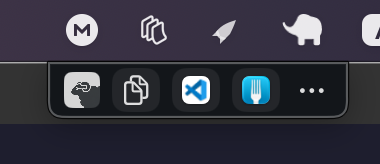

# Herdr Tools



A native Swift macOS bar that launches apps for the folder focused in Herdr.
The compact 28-point bar sizes itself to its contents and floats at the very top of the screen, starting at 65% of the screen width and clamped inside the menu-bar area.
The leading icon is the Herdr logo; drag it left or right to move the bar, and the position is remembered.
**Switch display** in the ellipsis menu moves the bar to the next display and remembers it.
On displays with a camera notch it uses an unobscured area beside the notch.
Apps are fully user-defined and saved in config; buttons use icons with names shown on hover.

## Build and run

Requires macOS 14 or later, Swift 6, and the `hammer` task runner.

```sh
hammer install
hammer run
```

`hammer install` builds and signs Herdr Tools, copies it to `/Applications/Herdr_Tools.app`, verifies the installed bundle's signature, then quits any running copy and launches the fresh build.
Use `hammer build` to build `build/Herdr_Tools.app` without installing.
Run `hammer` to list the available tasks.

The app icon is the Herdr logo with a unicorn horn, stored in `Resources/HerdrToolsIcon.png`.
The build generates standard and Retina icon sizes and packages them as `HerdrTools.icns` in the app bundle.
It is derived from `Resources/HerdrIcon.png` by `tools/make_icon.py`.

The first button is built in and copies the Herdr focused folder path to the clipboard.
Click an app button to run it for the folder focused in Herdr.
Herdr Tools activates itself first so the app opens on the display where the bar is.
The folder is read fresh on every click from `herdr pane list` (the focused pane's `foreground_cwd`, falling back to `cwd`), and is passed to the command in `FOLDER`, so `$FOLDER` expands to it.
If Herdr has no focused pane, Herdr Tools shows an alert instead of launching.
The **Add application** and **Edit applications** menu items open the app editor and the applications manager, where you can edit, remove, and drag to reorder apps.
Adding one lets you pick an installed app to prefill name and command, or set them yourself.
An app's icon is taken from the app in its command; if that fails it falls back to an SF Symbol.
Right-click an app button to edit or remove it.
Right-click the bar to slide it up and hide it for five seconds, then it slides back down.
The ellipsis menu includes a Quit action.

There are no built-in apps or saved folders: the bar shows only the applications you define.

Applications are saved to `~/Library/Application Support/ProjectBar/apps.json`.
Quitting Herdr Tools leaves other apps running.

## Limitations

Apps open with their own default window size; Herdr Tools does not move or resize them.
The stripe uses the display where it initially opens and adapts to display geometry changes.

## Validation

```sh
hammer test
hammer build
codesign --verify --strict build/Herdr_Tools.app
```

The automated tests cover bar layout, notch-aware placement, safe command quoting, and Herdr focused-folder parsing.
